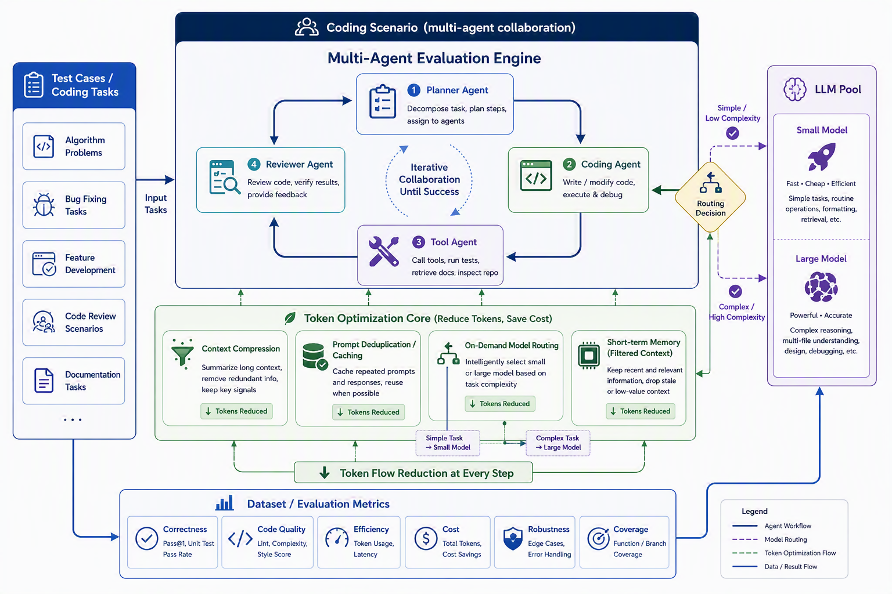
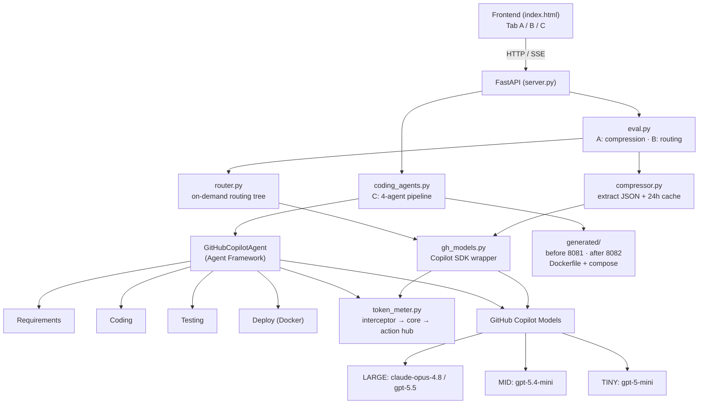

# EvalAgentic — Token Evaluation Playground

A hands-on evaluation system that demonstrates **token-cost optimization** for LLM
applications, built on the **GitHub Copilot Python SDK** and the **Microsoft Agent
Framework**. It compares the *same scenario* **before vs. after** optimization and
visualizes the result in a single HTML + JS page.

> Languages: English (this file) · [中文](README.zh.md)

Models used (via GitHub Copilot). Pricing follows the **GitHub Copilot models table**
(Credits per 1M tokens, `1 credit = $0.01`), with a single unified rate per model —
no separate individual/enterprise pricing:

| Tier  | Model           | Credits per 1M (In / Out) | Typical use |
|-------|-----------------|---------------------------|-------------|
| LARGE | `gpt-5.5`       | `500` / `3000`            | Agents, codegen, multi-step reasoning |
| LARGE | `claude-opus-4.8` | `500` / `2500`          | Agents, codegen, multi-step reasoning |
| MID   | `gpt-5.4-mini`  | `75` / `450`              | Dialogue, summarization, extraction |
| TINY  | `gpt-5-mini`    | `25` / `200`              | Classification, keyword/rule matching |

Cost is computed directly from each model's input/output credit rates and converted to
USD (`credits × $0.01`). The full model rate table lives in
`backend/token_meter.py` (`MODEL_CREDITS_PER_1M`).

---

## Architecture





| Layer | Component | Responsibility |
|-------|-----------|----------------|
| UI | `frontend/index.html` | Tabs A/B/C, live SSE log, before/after charts |
| API | `backend/server.py` | FastAPI routes + SSE streaming |
| Orchestration | `eval.py`, `coding_agents.py` | A/B eval · C multi-agent pipeline |
| Core | `compressor.py`, `router.py`, `gh_models.py`, `token_meter.py` | extraction+cache · routing · SDK calls · metering |
| Providers | GitHub Copilot SDK · Agent Framework | model access (LARGE/MID/TINY) |

---

## What it shows

The web UI has three tabs, each a **before/after comparison on the same scenario**:

### A. Compression comparison
Long-tail natural-language text (résumés, product manuals, contracts) is:
1. **Redundancy detection** — spot the long-tail text.
2. **Structured extraction** — Copilot turns it into JSON, dropping prose.
3. **Dynamic injection** — the prompt carries only the fields the task needs.
4. **Cache reuse** — identical entities reuse the structured result for 24h.

```
"张三于 2018 年 9 月就读于清华大学计算机科学与技术系……(2,500 words)"
   ↓ compress
{ "name": "张三", "degree": "本科", "school": "清华大学",
  "major": "计算机·AI 方向", "year": 2022,
  "achievements": ["国家奖学金", "ACM 亚洲区铜牌"] }
```

### B. On-demand model routing
A 30× price gap separates LARGE and TINY models, so simple tasks should not pay for
a high-end model. The routing tree (`backend/router.py`):

```
INCOMING REQUEST
        └─ Prompt < 500 tokens?  ── YES ─→ TINY   (classify · extract)
                                                                                                         └─ NO ──→ multi-step reasoning?
                                                                                                                                                         ├─ NO  ─→ MID   (dialogue · summary)
                                                                                                                                                         └─ YES ─→ LARGE (agent · code)
```

### C. Coding scenario — multi-agent (Agent Framework)
The same deliverable (a Taobao-like **goods-list site**: HTML + JS frontend, Flask
backend, Dockerized) is produced twice by a 4-agent pipeline:

```
需求分析 → 编程 → 测试 → 部署(Docker)
Requirements → Coding → Testing → Deployment
```

- **BEFORE** (处理前): no compression, every agent uses GPT-5.5 (LARGE) → deploys to port **8081**
- **AFTER** (处理后): compressed JSON spec injection + on-demand routing
  (requirements=MID, coding=LARGE, testing=MID, deploy=TINY) → deploys to port **8082**

Each agent is **token-metered**, runs a **review + self-heal** step, and streams its
execution steps live to the page via Server-Sent Events. A final overall comparison
plus a Docker deploy panel are shown.

> The headline metric for scenario C is **cost** (not raw token count): on-demand
> routing can lower cost ~30% even when token count rises, because cheaper tiers cost
> 30× less.

---

## Token counter design

`backend/token_meter.py` implements a non-invasive interceptor:

```
INTERCEPTOR (@token_meter decorator)
        │
        ▼
COUNTER CORE  ── accounting · budget threshold · trigger
        │
        ▼
ACTION HUB    ── throttle (>80% budget) · rollback (>budget)
```

Tokens are counted with `tiktoken` (provider-independent), and cost is accrued per
tier. If the `cl100k_base` encoding cannot be fetched locally at startup, the app
falls back to an approximate offline counter so the server can still boot.

---

## Project structure

```
EvalAgentic/
├── backend/
│   ├── gh_models.py      # GitHub Copilot SDK wrapper (single-prompt calls)
│   ├── token_meter.py    # interceptor decorator + counter core + action hub
│   ├── compressor.py     # structured extraction → JSON + 24h cache
│   ├── router.py         # on-demand routing tree
│   ├── eval.py           # A/B orchestration (compression / routing)
│   ├── coding_agents.py  # scenario C: 4-agent pipeline (Agent Framework)
│   ├── server.py         # FastAPI server + SSE streaming endpoint
│   └── requirements.txt
├── frontend/
│   └── index.html        # single-page UI (Tabs A / B / C)
├── generated/            # scenario C output: before/ after/ + docker-compose + deploy.sh
└── imgs/                 # reference diagrams (routing tree, token counter)
```

---

## Setup & run

Prerequisites:
- Python 3.11+ (tested on 3.12, conda env `agentdev`)
- An authenticated GitHub Copilot CLI / subscription

```bash
conda activate agentdev
pip install -r backend/requirements.txt

# start the server
cd backend
uvicorn server:app --port 8077
```

Open <http://localhost:8077> and try Tabs A / B / C.

> If a Copilot call fails with `Authorization error, you may need to run /login`,
> authenticate the Copilot CLI first (run `copilot` then `/login`, or `gh auth login`).
> Transient session/auth/timeout errors are retried automatically with backoff.

---

## API

| Method | Path                  | Description |
|--------|-----------------------|-------------|
| POST   | `/api/compression`    | Scenario A — compression before/after |
| POST   | `/api/routing`        | Scenario B — routing before/after |
| POST   | `/api/coding`         | Scenario C — full multi-agent run (JSON result) |
| POST   | `/api/coding/stream`  | Scenario C — SSE stream of per-agent steps |

---

## Deploy the generated sites (scenario C)

After running Tab C, two deployable projects exist under `generated/`:

```bash
cd generated && ./deploy.sh
# BEFORE → http://localhost:18081   AFTER → http://localhost:18082
```

> Host ports are mapped to **18081 / 18082** (the containers still listen on 8081 /
> 8082 internally) to avoid colliding with other services that may already use
> 8081 / 8082 on the host.

---

## References

- GitHub Copilot Python SDK — <https://github.com/github/copilot-sdk/blob/main/python/README.md>
- Agent Framework · GitHub Copilot provider — <https://github.com/microsoft/agent-framework/tree/main/python/samples/02-agents/providers/github_copilot>
- Agent Framework · Workflows — <https://github.com/microsoft/agent-framework/tree/main/python/samples/03-workflows>
