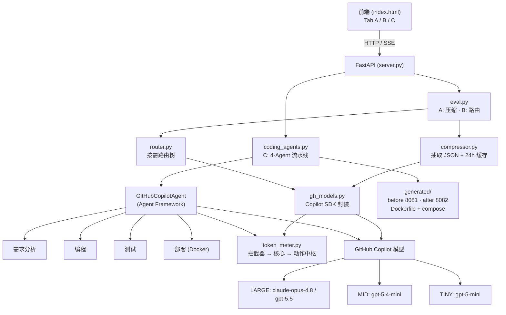

# EvalAgentic — Token 评估实验台

一个用于演示 LLM 应用 **Token 成本优化** 的实战评估系统,基于 **GitHub Copilot Python
SDK** 与 **Microsoft Agent Framework** 构建。它在 *相同场景* 下做 **处理前 vs 处理后**
对比,并用一个 HTML + JS 页面可视化结果。

> 语言:中文(本文) · [English](README.md)

所用模型(经由 GitHub Copilot):

| 档位  | 模型             | 单价(每 1K tokens) | 典型用途 |
|-------|-----------------|---------------------|----------|
| LARGE | `claude-opus-4.8`、`gpt-5.5` | $0.030 | Agent、代码生成、多步推理 |
| MID   | `gpt-5.4-mini`  | $0.012 | 对话、摘要、抽取 |
| TINY  | `gpt-5-mini`    | $0.001 | 分类、关键词/规则匹配 |

---

## 架构




| 层级 | 组件 | 职责 |
|------|------|------|
| UI | `frontend/index.html` | Tab A/B/C、实时 SSE 日志、处理前/后图表 |
| API | `backend/server.py` | FastAPI 路由 + SSE 流式 |
| 编排 | `eval.py`、`coding_agents.py` | A/B 评估 · C 多 Agent 流水线 |
| 核心 | `compressor.py`、`router.py`、`gh_models.py`、`token_meter.py` | 抽取+缓存 · 路由 · SDK 调用 · 计量 |
| 提供方 | GitHub Copilot SDK · Agent Framework | 模型访问(LARGE/MID/TINY) |

---

## 展示内容

页面有三个 Tab,每个都是 **同一场景的 处理前/处理后 对比**:

### A. 压缩对比
把长尾自然语言(简历、产品手册、合同模板)按如下处理:
1. **识别冗余** — 找出长尾文本。
2. **结构化抽取** — Copilot 转 JSON,丢掉自然语言修饰。
3. **动态注入** — Prompt 只携带任务真正需要的字段。
4. **缓存复用** — 相同实体的结构化结果 24h 内复用。

```
"张三于 2018 年 9 月就读于清华大学计算机科学与技术系……(2,500 字)"
   ↓ 压缩
{ "name": "张三", "degree": "本科", "school": "清华大学",
  "major": "计算机·AI 方向", "year": 2022,
  "achievements": ["国家奖学金", "ACM 亚洲区铜牌"] }
```

### B. 按需调用(模型路由)
LARGE 与 TINY 模型单价相差 30×,简单任务无须高阶模型。路由树(`backend/router.py`):

```
INCOMING REQUEST
  └─ Prompt < 500 tokens?  ── 是 ─→ TINY  ($0.001/K)  分类 · 抽取
                           └─ 否 ─→ 需要多步推理?
                                       ├─ 否 ─→ MID  ($0.012/K)  对话 · 摘要
                                       └─ 是 ─→ LARGE ($0.030/K) Agent · 代码
```

### C. 编码场景 — 多 Agent(Agent Framework)
同一交付物(类淘宝 **货物列表** 站点:HTML + JS 前端、Flask 后端、Docker 部署)由 4 个
Agent 流水线生成两遍:

```
需求分析 → 编程 → 测试 → 部署(Docker)
```

- **BEFORE 处理前**:不压缩,每个 Agent 都用 GPT-5.5 (LARGE) → 部署到端口 **8081**
- **AFTER 处理后**:压缩后的 JSON 规格注入 + 按需路由
  (需求=MID、编程=LARGE、测试=MID、部署=TINY) → 部署到端口 **8082**

每个 Agent 都 **计量 token**,都做 **review + 自我修复**,并通过 Server-Sent Events 把
执行步骤实时推送到页面。最后给出整体对比与 Docker 部署面板。

> 场景 C 的核心指标是 **成本**(而非纯 token 数):按需调用即使 token 数上升,凭 30×
> 价差仍能把成本降低约 30%。

---

## Token 计数器设计

`backend/token_meter.py` 实现了一个非侵入式拦截器:

```
INTERCEPTOR (@token_meter 装饰器)
        │
        ▼
COUNTER CORE  ── 记账 · 预算阈值 · 触发
        │
        ▼
ACTION HUB    ── 限流(>80% 预算) · 回滚(>预算)
```

Token 用 `tiktoken` 计数(与具体厂商无关),并按档位累计成本。

---

## 项目结构

```
EvalAgentic/
├── backend/
│   ├── gh_models.py      # GitHub Copilot SDK 封装(单次 prompt 调用)
│   ├── token_meter.py    # 拦截器装饰器 + 计数核心 + 动作中枢
│   ├── compressor.py     # 结构化抽取 → JSON + 24h 缓存
│   ├── router.py         # 按需路由树
│   ├── eval.py           # A/B 编排(压缩 / 路由)
│   ├── coding_agents.py  # 场景 C:4-Agent 流水线(Agent Framework)
│   ├── server.py         # FastAPI 服务 + SSE 流式接口
│   └── requirements.txt
├── frontend/
│   └── index.html        # 单页 UI(Tab A / B / C)
├── generated/            # 场景 C 产物:before/ after/ + docker-compose + deploy.sh
└── imgs/                 # 参考示意图(路由树、Token 计数器)
```

---

## 安装与运行

前置条件:
- Python 3.11+(已在 3.12 / conda 环境 `agentdev` 验证)
- 已授权的 GitHub Copilot CLI / 订阅

```bash
conda activate agentdev
pip install -r backend/requirements.txt

# 启动服务
cd backend
uvicorn server:app --port 8077
```

打开 <http://localhost:8077>,体验 Tab A / B / C。

> 若 Copilot 调用报 `Authorization error, you may need to run /login`,请先给 Copilot
> CLI 授权(运行 `copilot` 后执行 `/login`,或 `gh auth login`)。瞬态的
> 会话/授权/超时错误会自动退避重试。

---

## API

| 方法   | 路径                  | 说明 |
|--------|-----------------------|------|
| POST   | `/api/compression`    | 场景 A — 压缩 处理前/后 |
| POST   | `/api/routing`        | 场景 B — 路由 处理前/后 |
| POST   | `/api/coding`         | 场景 C — 完整多 Agent 运行(返回 JSON) |
| POST   | `/api/coding/stream`  | 场景 C — 逐 Agent 步骤的 SSE 流 |

---

## 部署生成的站点(场景 C)

运行 Tab C 后,`generated/` 下会有两个可部署项目:

```bash
cd generated && ./deploy.sh
# BEFORE → http://localhost:18081   AFTER → http://localhost:18082
```

> 宿主机端口映射到 **18081 / 18082**(容器内部仍监听 8081 / 8082),以避免与宿主机上
> 可能已占用 8081 / 8082 的其它服务冲突。

---

## 参考

- GitHub Copilot Python SDK — <https://github.com/github/copilot-sdk/blob/main/python/README.md>
- Agent Framework · GitHub Copilot provider — <https://github.com/microsoft/agent-framework/tree/main/python/samples/02-agents/providers/github_copilot>
- Agent Framework · Workflows — <https://github.com/microsoft/agent-framework/tree/main/python/samples/03-workflows>
